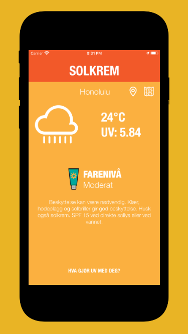
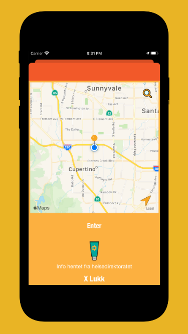
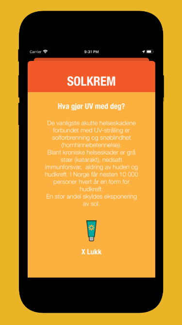

# Solkrem

Mobile application that provides the current weather report and UV status.
The app uses a network API connected to openweathermap.org

Technologies used
* CoreLocation
* REST API - https://openweathermap.org/api
* Networking with Codable
* CoreAnimation
* Storyboard UI

#Main screen

 

#Location screen

 

#Info screen

